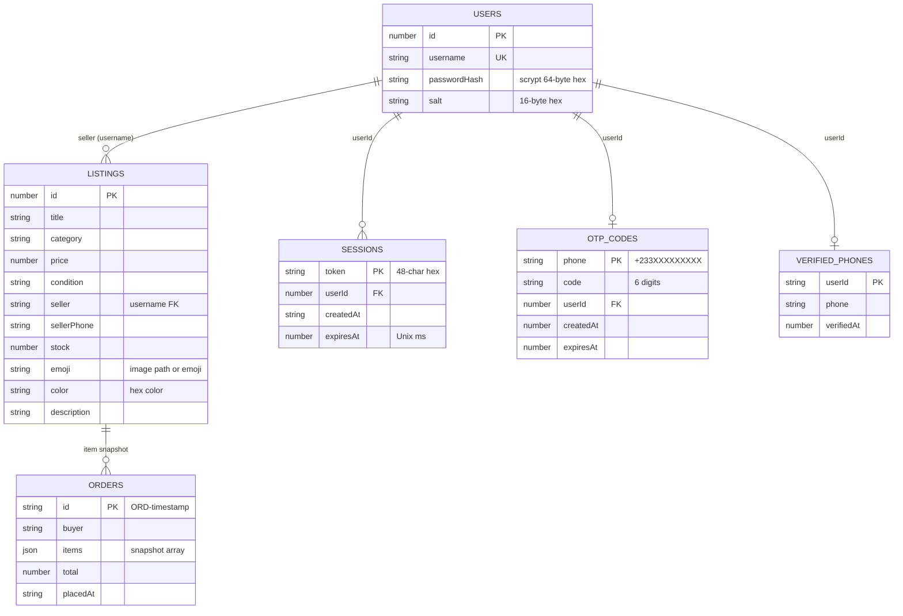
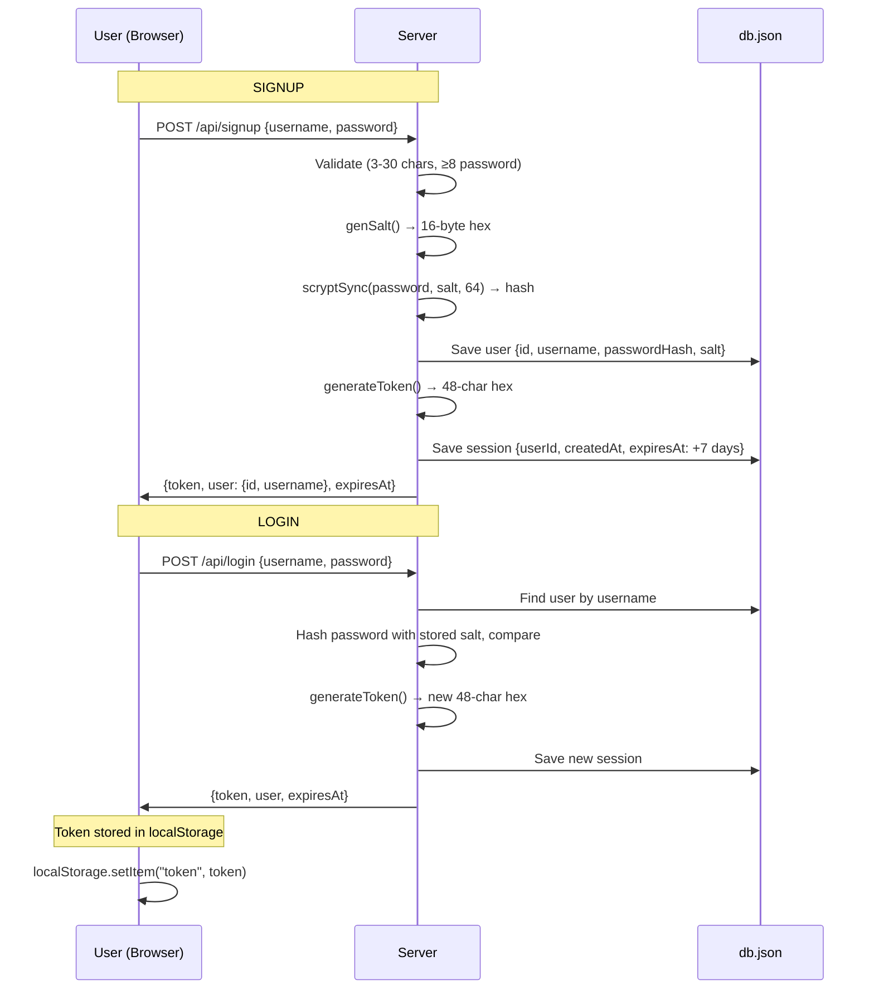
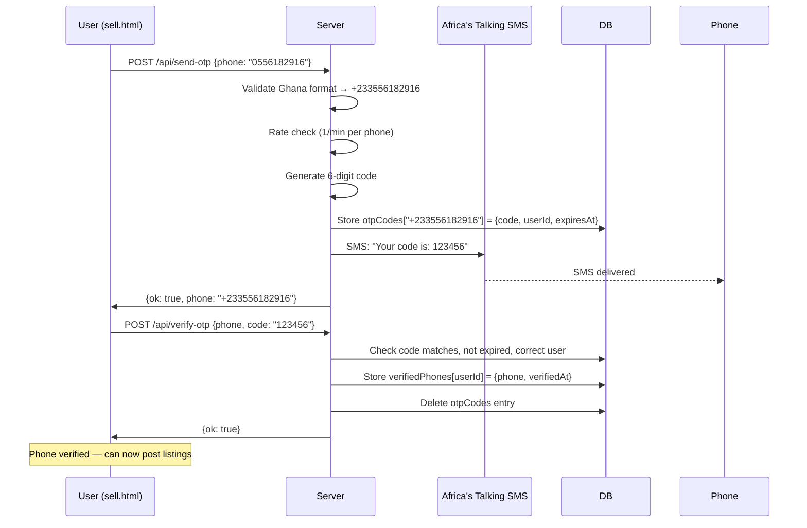
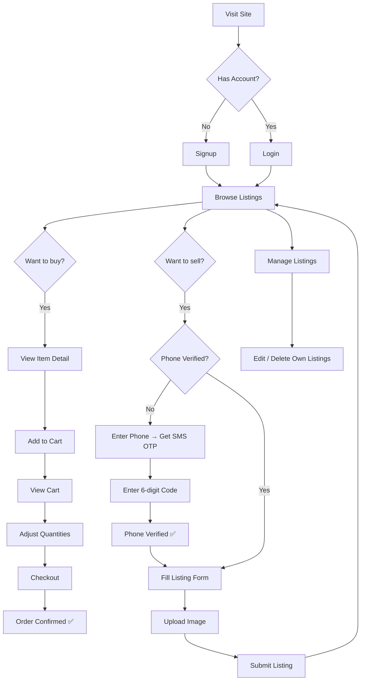

# Ricchy's Store — Complete Site Logic & Architecture

## Project Overview

**Ricchy's Store** is a full-stack marketplace web application built with **pure Node.js** (no Express) on the backend and **vanilla HTML/CSS/JS** on the frontend. Users can browse listings, post items for sale (after phone verification via SMS OTP), add items to a cart, and checkout.

---

## Project Structure

```
barter-marketplace/
├── server.js                  # Backend: HTTP server, API routes, auth, SMS
├── db.json                    # File-based JSON database
├── package.json               # Dependencies: africastalking, busboy, sharp
├── .env                       # AT credentials (auto-loaded via defaults)
└── public/                    # Static frontend files
    ├── index.html             # Home page — browse & search listings
    ├── item.html              # Single item detail page
    ├── cart.html               # Shopping cart & checkout
    ├── sell.html              # Post new listing (with OTP gate)
    ├── manage.html            # Manage own listings (edit/delete)
    ├── login.html             # Login form
    ├── signup.html            # Registration form
    ├── css/style.css          # All styles (single file)
    ├── js/cart.js             # Shared utilities (API, Cart, auth, toast)
    ├── uploads/               # User-uploaded images (generated at runtime)
    └── bookimages/            # Static book cover images
```

---

## Database Schema (`db.json`)

The database is a single JSON file read/written synchronously. It contains 8 top-level keys:



| Key | Current Count | Description |
|-----|:---:|-------------|
| `listings` | 6 | Product listings with image paths |
| `users` | 4 | Registered accounts |
| `sessions` | 9 | Active login tokens (7-day TTL) |
| `orders` | 1 | Placed orders |
| `otpCodes` | 0 | Temporary OTP codes (auto-cleaned) |
| `verifiedPhones` | 3 | Phone numbers verified by users |
| `nextId` | 26 | Auto-increment for listing IDs |
| `nextUserId` | 20 | Auto-increment for user IDs |

---

## Backend API Routes

### Authentication (No Auth Required)

| Method | Path | Description |
|--------|------|-------------|
| `POST` | `/api/signup` | Create account (username 3-30 chars, password ≥ 8). Returns `{ token, user, expiresAt }` |
| `POST` | `/api/login` | Login with username + password. Returns `{ token, user, expiresAt }` |

### User & Verification (Auth Required)

| Method | Path | Description |
|--------|------|-------------|
| `GET` | `/api/me` | Returns current user: `{ id, username, phoneVerified }` |
| `POST` | `/api/send-otp` | Send 6-digit OTP to Ghana phone. Rate limited: 1/min per phone. 10-min expiry. |
| `POST` | `/api/verify-otp` | Verify OTP code. Marks phone as verified for user. |
| `POST` | `/api/logout` | Deletes session token. Always returns `{ ok: true }`. |

### Listings

| Method | Path | Auth? | Description |
|--------|------|:-----:|-------------|
| `GET` | `/api/listings` | No | List all. Supports `?search=` and `?category=` filters |
| `GET` | `/api/listings/:id` | No | Get single listing |
| `GET` | `/api/categories` | No | Unique sorted category list |
| `GET` | `/api/my-listings` | Yes | Listings where seller = current user |
| `POST` | `/api/listings` | Yes + Phone ✅ | Create listing. Requires verified phone. |
| `PUT` | `/api/listings/:id` | Yes (owner) | Update listing fields |
| `DELETE` | `/api/listings/:id` | Yes (owner) | Delete listing |

### Uploads & Orders

| Method | Path | Auth? | Description |
|--------|------|:-----:|-------------|
| `POST` | `/api/upload-image` | Yes | Upload image (max 5MB). Creates full + 300×300 thumbnail via `sharp`. |
| `POST` | `/api/checkout` | No | Place order. Decrements stock. Buyer defaults to "guest". |

---

## Authentication Flow



**Client-side**: Token stored in `localStorage` as `"token"`. All authenticated requests include `Authorization: Bearer <token>` header.

---

## Phone OTP Verification Flow



**Gate**: `POST /api/listings` returns **403** if user's phone is not verified.

---

## Frontend Pages & Logic

### Shared Utilities — [cart.js](file:///c:/Users/X270/OneDrive/Desktop/KUMDOJI%20FILES/updated/barter-marketplace/public/js/cart.js)

Loaded on every page. Provides:

| Component | Purpose |
|-----------|---------|
| `api.get(url)` / `api.post(url, body)` | Fetch wrapper with auth headers + JSON parsing |
| `Cart.read()` | Read cart from `localStorage` → `{ id: qty }` map |
| `Cart.add(id)` | Add item to cart (increment qty) |
| `Cart.remove(id)` | Remove item from cart |
| `Cart.setQty(id, qty)` | Set specific quantity |
| `Cart.clear()` | Empty the cart |
| `Cart.count()` | Total number of items |
| `escapeHTML(str)` | XSS prevention — escapes `& < > " '` |
| `updateAuthUI()` | Shows/hides login/logout/manage links based on token |
| `showToast(msg, duration)` | Non-blocking notification popup |

---

### Page-by-Page Logic

#### 🏠 [index.html](file:///c:/Users/X270/OneDrive/Desktop/KUMDOJI%20FILES/updated/barter-marketplace/public/index.html) — Home / Browse

- **On load**: Fetches `GET /api/listings` + `GET /api/categories`
- **Search**: Live search via URL param `?search=` — filters by title/description/category server-side
- **Category chips**: Clickable filter buttons — fetched from API, highlights active category
- **Listing cards**: Grid layout with image, title, price, condition badge, "Add to cart" button
- **Image rendering**: `renderMedia()` extracts `src` from HTML img tags, handles file paths, base64, and emoji fallback
- **Add to cart**: `Cart.add(id)` → updates `localStorage` → shows toast notification
- **URL state**: Category and search preserved in `?cat=` and `?search=` query params

#### 📦 [item.html](file:///c:/Users/X270/OneDrive/Desktop/KUMDOJI%20FILES/updated/barter-marketplace/public/item.html) — Item Detail

- **On load**: Reads `?id=` from URL → fetches `GET /api/listings/:id`
- **Displays**: Large image, title, price, condition, description, seller info, stock count
- **Contact seller**: Shows phone number with `tel:` link and WhatsApp link
- **Add to cart**: Button with stock validation
- **Related listings**: Fetches same-category listings and displays in a row

#### 🛒 [cart.html](file:///c:/Users/X270/OneDrive/Desktop/KUMDOJI%20FILES/updated/barter-marketplace/public/cart.html) — Shopping Cart

- **On load**: Reads cart from `localStorage` → fetches each listing by ID in parallel
- **Displays**: Item rows with image, title, unit price, quantity input, line total, remove button
- **Quantity change**: Updates `localStorage` → re-renders cart
- **Summary card**: Item count, subtotal, delivery note, total
- **Checkout**: `POST /api/checkout` with items array → clears cart → shows order confirmation with order ID
- **Empty state**: Shows 🛒 emoji with "Browse listings" link

#### 📝 [sell.html](file:///c:/Users/X270/OneDrive/Desktop/KUMDOJI%20FILES/updated/barter-marketplace/public/sell.html) — Post Listing

- **Auth gate**: Redirects to `login.html` if no token
- **OTP modal** (3-step flow):
  1. **Enter phone** → calls `POST /api/send-otp` → 60-second resend cooldown
  2. **Enter 6-digit code** → calls `POST /api/verify-otp`
  3. **Success** → closes modal, shows listing form
- **Form fields**: Title, category, condition, price, quantity, description, phone, address, image upload, emoji icon
- **Image upload**: Drag-and-drop zone + file picker → `POST /api/upload-image` → displays preview
- **Submit**: `POST /api/listings` with all fields → redirect to home page on success

#### ⚙️ [manage.html](file:///c:/Users/X270/OneDrive/Desktop/KUMDOJI%20FILES/updated/barter-marketplace/public/manage.html) — Manage Listings

- **Auth gate**: Redirects to `login.html` if no token
- **On load**: Fetches `GET /api/my-listings`
- **Displays**: List of own listings with image, title, price, stock, edit/delete buttons
- **Delete**: Confirmation dialog → `DELETE /api/listings/:id` → re-renders list
- **Empty state**: Shows 📝 emoji with "Sell one now" link

#### 🔐 [login.html](file:///c:/Users/X270/OneDrive/Desktop/KUMDOJI%20FILES/updated/barter-marketplace/public/login.html) — Login

- **Form**: Username + password
- **Submit**: `POST /api/login` → stores token in `localStorage` → redirects to `index.html`
- **Link**: "Don't have an account? Sign up"

#### 📋 [signup.html](file:///c:/Users/X270/OneDrive/Desktop/KUMDOJI%20FILES/updated/barter-marketplace/public/signup.html) — Register

- **Form**: Username + password + confirm password
- **Validation**: Password match check (client-side)
- **Submit**: `POST /api/signup` → stores token in `localStorage` → redirects to `index.html`
- **Link**: "Already have an account? Log in"

---

## Client-Side State Management

| Storage | Key | Data | Used By |
|---------|-----|------|---------|
| `localStorage` | `token` | Session token (48-char hex) | All pages — auth header |
| `localStorage` | `cart` | JSON object `{ listingId: qty }` | Cart operations across pages |

---

## Complete User Flows



---

## Security Summary

| Area | Status | Details |
|------|:------:|---------|
| Password hashing | ✅ | scrypt with random 16-byte salt |
| Session management | ✅ | 7-day TTL, lazy cleanup, secure token generation |
| OTP rate limiting | ✅ | 1 per minute per phone, 10-min expiry |
| Image upload validation | ✅ | MIME type check, 5MB limit, sharp processing |
| Directory traversal | ✅ | Static file server blocks `..` paths |
| XSS prevention | ✅ | `escapeHTML()` used consistently in templates |
| CORS | ⚠️ | Fully open (`*`) — fine for dev, restrict for prod |
| CSRF protection | ❌ | None — token-based auth partially mitigates |
| Checkout auth | ❌ | No authentication required for placing orders |
| API key in source | ⚠️ | AT key hardcoded as default fallback |

---

## Identified Gaps & Feature Opportunities

### Missing Core Logic
1. **No edit UI for listings** — `PUT /api/listings/:id` endpoint exists but manage.html only has delete
2. **No user profile page** — no way to view/edit account info or change password
3. **No order history** — orders are stored but no page displays them
4. **No seller dashboard** — sellers can't see orders for their items
5. **Guest checkout only** — buyer identity is just a string ("guest"), no tracking
6. **No payment integration** — checkout just records the order and decrements stock
7. **No address/delivery system** — address field on sell form but no delivery logic
8. **No notifications** — seller isn't notified when their item is ordered

### Improvement Opportunities
9. **Search improvements** — no pagination, no sorting (price, date, relevance)
10. **Wishlist / Save for later** — no favoriting mechanism
11. **Reviews & ratings** — no buyer/seller feedback system
12. **Chat/messaging** — no buyer-seller communication within the platform
13. **Admin panel** — no moderation tools or content management
14. **Email notifications** — only SMS exists, no email for order confirmations
15. **Social login** — only username/password auth, no Google/Facebook
16. **Mobile responsiveness** — CSS exists but could be improved for small screens

> [!NOTE]
> This document captures the **complete current state** of the codebase logic. Use it as the foundation for planning which features to add next.
